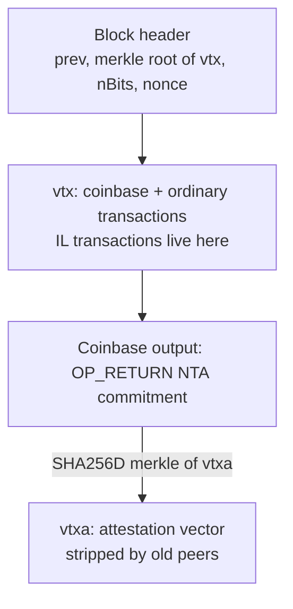

```
BIP: unassigned
Title: Node Template Attestation
Author: Mike Moore <mrmoore27@pm.me>
Comments-Summary: No comments yet.
Comments-URI:
Status: Draft
Type: Standards Track
Layer: Consensus (soft fork)
Created: 2026-09-07
License: BSD-2-Clause
Post-History:
```

# Node Template Attestation

A **draft** soft fork. It has no BIP number, no version bit, and no activation
parameters. It is not a Bitcoin Core or Bitcoin Knots patch. A Python
`ConnectBlock` model and tests live beside this file.

## Abstract

After activation, a block is valid only if every value-bearing coinbase
output is backed by a **node-template attestation** committed in that same
block, and only if the block actually contains the **feasible inclusion-list
(IL)** transactions those attestations named.

The attestation vector is not part of the 80-byte header. It is bound the
same way SegWit bound witness data: a magic `OP_RETURN` in the coinbase
whose 32-byte payload is a hash of the new data. Old nodes ignore the
`OP_RETURN` and still see a normal block. New nodes reject a block that
pays a script with no proof, or that pays a node-miner and then omits the
transactions that miner's node required.

The rule is about **coinbase payees**, not about who found the block.
Pooling, TIDES-style splits, and DATUM stay legal. A hasher who never ran
a node, and never produced an attestation, cannot appear in the coinbase.

## Copyright

This document is licensed under the 2-clause BSD license.

## Motivation

Stratum V1 lets a pool be the only author of the block template. Hashers
authenticate as usernames. The pool can omit transactions (policy filters,
OFAC lists, fee discrimination) and the chain cannot tell a 50% pool from
a 50% solo farm.

DATUM and Stratum V2 Job Declaration already move template construction
to the miner **when the miner runs a node**. They are pool protocols. They
are not consensus. A pool can still pay those miners and drop their
transactions, or pay people who never ran a node at all.

This draft asks consensus for one thing:

> If a block pays you, it must include the transactions your node wanted,
> whenever those transactions are still feasible.

"Wanted" is a short, capped inclusion list inside an attestation, not a
full mempool dump. "Feasible" is a pure function of the previous UTXO set
and the block, not of any node's local mempool.

### What this is not

Bitcoin cannot see a process named `bitcoind`. Anyone who *can* run a node
can grind an attestation that pays someone else's script (a **gifted**
name). A pool that only pays itself, and settles hashers off-chain, is
indistinguishable from a large solo miner. Those limits are physics, not
unfinished work. They are stated again under [Limitations](#limitations).

## Specification

The specification is consensus rules for **full nodes** after the
(unspecified) activation point. Policy, wallets, and pool software are
non-normative and live in later sections.

### 1. Soft-fork packaging

The 80-byte header is unchanged. The transaction merkle root is unchanged
in meaning: it still commits to the ordinary `vtx` list, coinbase first.

New data is an **attestation vector** `vtxa`, analogous to the witness
vector in BIP141:

* It is not hashed into `hashMerkleRoot`.
* It is hashed into a commitment in a coinbase `scriptPubKey`.
* Peers that do not implement this draft strip it, as pre-SegWit peers
  stripped witnesses.
* A block whose `vtx` is valid under today's rules remains valid to old
  nodes even when `vtxa` is present.

New nodes, after activation, **tighten** the rules: some blocks that old
nodes would accept become invalid. That is a soft fork. If a majority of
hashrate produces only new-valid blocks, old nodes follow that chain
because it is the heaviest chain they still consider valid.



### 2. Coinbase commitment

A coinbase output is an **NTA commitment** if and only if its
`scriptPubKey` is at least 38 bytes and begins with exactly these 6 bytes:

```
0x6a 0x24 0x4e 0x54 0x41 0x01
```

That is `OP_RETURN`, `OP_PUSHBYTES_36`, then the 4-byte magic `NTA` ||
`0x01`. The following 32 bytes are `nta_commit`.

Define:

```
nta_root     = MerkleRoot(SHA256D(serialize(vtxa[i])) for i in 0..n-1)
nta_reserved = 32 zero bytes   // v1; non-zero is invalid
nta_commit   = SHA256D(nta_root || nta_reserved)
```

MerkleRoot is the Bitcoin transaction merkle tree, including the
duplicated-tail quirk, over those 32-byte leaves. If `n = 0`, `nta_root`
is `SHA256D(empty)`.

After activation a block is invalid unless:

1. The coinbase has **exactly one** NTA commitment output.
2. That output's `nValue` is `0`.
3. `nta_commit` equals the 32 bytes in the script.
4. `nta_reserved` is 32 zero bytes.

The SegWit witness commitment (`0xaa21a9ed`, BIP141) is a different magic.
A block may have both. Scanning outputs for the NTA prefix must not
confuse the two.

0-value `OP_RETURN` outputs, including this one and the witness
commitment, are **not** value-bearing payees. They do not need
attestations.

### 3. Value-bearing payees

Let `V` be the list of coinbase outputs with `nValue > 0` whose
`scriptPubKey` is not provably unspendable (`OP_RETURN` and equivalent).

* `nValue < 0` is already invalid.
* An anyone-can-spend coinbase output with `nValue > 0` is invalid under
  this draft (same spirit as wasting subsidy; the Python model rejects
  it explicitly).
* Two outputs may share the same `scriptPubKey`. They share one
  attestation.

After activation, for every distinct `scriptPubKey` in `V` there must be
**exactly one** attestation in `vtxa` whose `scriptPubKey` field equals
it. A value-bearing output with no attestation is invalid
(`unattested_payee`). A Stratum username, by itself, is not an
attestation.

Attestations whose scripts are **not** in `V` are allowed. They still
contribute IL transactions to the catalog. That lets a finder include an
unpaid miner's list. It does not let a finder pay a script that has no
attestation.

### 4. Attestation object

Each `vtxa[i]` deserializes to:

| Field | Type | Notes |
| --- | --- | --- |
| `scriptPubKey` | `CScript` | Payee this attestation is for |
| `nHeight` | `uint32` | Must equal the enclosing block height |
| `nBits` | `uint32` | Must equal the enclosing block `nBits` |
| `extra` | `CTransaction` | Non-coinbase; see below |
| `il` | `vector<CTransaction>` | Inclusion-list **bodies**, not txids |
| `nVersion` | `int32` | Must be `0x4e544101` (`NTA` \|\| `1`) |
| `nTime` | `uint32` | `MTP < nTime ≤ block.nTime` |
| `nNonce` | `uint32` | Grind |

`extra` must have at least one input, must be valid against the
**previous** UTXO set (the UTXO before this block's `vtx` is applied),
and must not exceed `MAX_EXTRA_WEIGHT` as computed by
`GetTransactionWeight`. It is **not** applied to the UTXO set. It is not
required to appear in `vtx`. Its job is to make a headers-only share
illegal: the attester had at least one real transaction in a template.

`il` is a list of full transactions, not a list of txids looked up in
the mempool. Two nodes with different mempools therefore cannot disagree.
Each IL transaction's weight is `GetTransactionWeight`; the sum must be
`≤ MAX_IL_WEIGHT`. The count must be `≤ MAX_IL_TXIDS`.

Identity of an IL transaction is its **wtxid** (BIP141). If two IL
bodies in the catalog (this block plus the last `W` blocks) share a
wtxid but are not byte-identical, the block is invalid
(`il_txid_conflict`). Claimed txids are not a field an author can set;
they are `SHA256D` of the serialization, as in Bitcoin today.

### 5. Attestation proof-of-work tag

The attestation is bound to a grind so a copied tag cannot ride a
different script, extra, or IL.

```
hashMerkleRoot_A = SHA256D(
    serialize(scriptPubKey) || extra.GetWitnessHash() || il_root
)
il_root          = MerkleRoot(il[j].GetWitnessHash() for j in 0..m-1)

header_A is 80 bytes:
    nVersion | hashPrevBlock | hashMerkleRoot_A | nTime | nBits | nNonce
```

`hashPrevBlock` must equal the previous block hash (the tip this block
extends). `SHA256D(header_A)` interpreted as a uint256 must be strictly
less than `share_target`, where

```
share_target = min(uint256_max, block_target * SHARE_K)
```

and `block_target` is the target implied by this block's `nBits`.
`SHARE_K = 1000` in this draft: one thousand times easier than the block
itself. Each payee is expected to grind this on their own node. The
block finder still needs full header proof of work.

If `SHA256D(header_A)` does not match the committed fields, that is
`att_pow_unbind`. If it meets the fields but is not under `share_target`,
that is `att_pow`.

### 6. Multiplex

Let `key = (nHeight, extra.GetHash())`. Two attestations in the same
block with the same `key` and different `scriptPubKey` are invalid
(`att_multiplex_tree`). One weak template cannot be rewritten into two
identities by flipping only the coinbase script.

Distinct extras (distinct node templates) for distinct scripts are valid.
That is a normal DATUM/TIDES split.

### 7. Caps

These are consensus, not policy.

| Name | Value | Why |
| --- | --- | --- |
| `MAX_ATTESTATIONS` | 512 | DATUM coinbases already cap on this order of outputs |
| `MAX_IL_TXIDS` | 256 | FOCIL-sized list |
| `MAX_IL_WEIGHT` | 32_000 WU | Per attestation; compact, not a mempool |
| `MAX_EXTRA_WEIGHT` | 32_000 WU | Per extra transaction |
| `MAX_NTA_SERIALIZED` | 131_072 bytes | Whole `vtxa`; DoS bound the Python model lacked as a single cap |
| `WINDOW_BLOCKS` (`W`) | 144 | ~1 day of carry-forward |
| `SHARE_K` | 1000 | Attestation grind vs block target |

Exceeding a cap is invalid. There is no "best effort" truncation.

`vtxa` **does not** count toward the 4,000,000 WU block weight. IL
**feasibility** uses computed `vtx` weight only, so stuffing `vtxa` or
lying about `block.weight` cannot evict an IL transaction.

### 8. Feasible inclusion list

`ConnectBlock` is a function of `(chain, block)` only. It does not read
the mempool.

**Catalog.** Union of every IL body in `vtxa` of this block with every IL
body from attestations in the last `W` blocks, indexed by wtxid. Conflict
→ invalid.

**Confirmed.** A set of wtxids already in the active chain's `vtx`
(bodies that connected). Those entries are dropped from the mandatory
set.

**Walk.** Sort remaining catalog bodies by wtxid. Start `weight` at the
**computed** coinbase weight (`GetTransactionWeight` of the actual
coinbase, including commitment outputs). For each body, skip it if:

* its wtxid is already confirmed, or
* it is not valid against the **previous** UTXO set (missing inputs,
  overspend, negative output, no inputs, internal double-spend), or
* its inputs overlap an IL transaction already taken in this walk
  (first-wins by wtxid), or
* `weight + GetTransactionWeight(body) > MAX_BLOCK_WEIGHT`.

Otherwise take it and add its weight and inputs.

This walk **does not look at `vtx`**. Filling the block with unrelated
transactions cannot change who was taken. A conflicting spend in `vtx`
cannot replace a taken IL transaction; if `vtx` spends those inputs on
something else, the block is invalid when the IL check fires.

**Satisfy.** Every taken body must appear in `vtx` with the same wtxid
(byte-identical witness-inclusive serialization). Missing →
`il_unsatisfied`.

Same-block IL *chains* (child spends parent listed in the same catalog)
are infeasible against the previous UTXO; only the parent is mandatory.
The child may still be included as an ordinary extra transaction once the
parent is in `vtx`. That is intentional.

### 9. Connect and undo

On a successful connect, full nodes:

1. Apply `vtx` to the UTXO set as today.
2. Add those wtxids to the confirmed set.
3. Append this block's IL bodies onto the carry-forward window.
4. Drop window entries older than `W` blocks.

Reorgs undo those three append-only structures the same way they undo
UTXO. IBD must download `vtxa` for at least the last `W` blocks, the same
class of requirement SegWit added for witness data. Headers-only nodes
cannot verify IL satisfaction; they could not verify inflation either.

### 10. P2P

Non-normative until a later BIP, but the packaging implies:

* A service bit for NTA-capable peers.
* `block` / `cmpctblock` / `blocktxn` extensions that carry `vtxa` for
  those peers and omit it for others.
* During IBD, `vtxa` for the recent window must be available. A
  `getnta` / `nta` pair is enough; the commitment in coinbase lets a peer
  authenticate the bytes.

Old peers see a valid pre-activation-style block with an extra
`OP_RETURN`. They do not need new messages.

### 11. Activation

Unspecified. This draft must not be read as proposing BIP9, BIP8, Speedy
Trial, a flag day, or a version bit. A later document can add that if
the rules survive review.

## Rationale

### Why a soft fork, not a new header field

A new header field is a hard fork. Old nodes would not parse the block.
Bitcoin does not take hard forks. SegWit already showed how to bind extra
data: put a hash in a coinbase `OP_RETURN` that old nodes treat as
anyone-can-not-spend dust, and relay the extra data only to new peers.

IL transactions themselves **must** live in `vtx`. That is the only
transaction list old nodes and new nodes share. The attestation vector
explains *which* of those transactions were mandatory and *who* required
them. Duplicating IL bodies inside `vtxa` is deliberate: the catalog
cannot depend on "look this txid up in your mempool," which forks, and it
cannot depend on "it will be in `vtx`" before feasibility is computed,
which would let stuffing change the walk.

### Why full bodies, not txids

An earlier sketch named txids and let each node resolve them from its
mempool. Two honest nodes, two catalogs, one block, two verdicts. That is
a consensus split. Test 42 of the reference model is the regression:
different local knowledge, same verdict, because bodies are in the block.

wtxid (not txid) is the Bitcoin identity so a witness swap cannot satisfy
someone else's IL.

### Why previous-UTXO feasibility, not leftover weight

FOCIL-style "include these if they still fit" lets the finder fill the
block with junk and evict the IL. This draft computes the mandatory set
*before* optional transactions. Tests 24 and 25 are the regressions for
conflict-replace and stuffing.

Claimed `block.weight` / `tx.weight` fields are not used. A finder who
could set those would evict anyone. Weights are computed from
serialization.

### Why fail closed

A missing `vtxa` on a paying coinbase is invalid, not "unattested, skip."
Otherwise a pool ships today's blocks forever.

### Why one attestation per script, not one DATUM share for a TIDES list

A single share that lists many names does not prove each name ran a node
or chose an IL. Each value-bearing script needs its own extra and grind.
Test 4 / test 38: paying a member forces *that* member's IL; piggybacking
the rest of the split does not attest them.

### Why the extra transaction

Without `extra`, an attestation is a grindable header. SPV hardware and
pool usernames already grind headers. `extra` must spend a real previous
output. That is still not "this process is bitcoind" — see Limitations —
but it is not a headers-only share.

### Why carry-forward

If IL died at the end of the block that attested it, a pool could pay a
DATUM miner, omit the IL, and hope that miner does not find the block.
Paying them once would have been enough to look compliant. The window
keeps their list mandatory until it confirms, expires, or becomes
infeasible.

## Limitations

These are not TODOs.

**Self-pay PPS.** A pool that pays only its own script, with an
attestation from a node it runs, and that settles hashers with IOUs, is
one miner. The chain cannot tell it from a large solo farm. Monte Carlo
in `world.py`: 100% PPS never includes transaction T.

**Gifted attestations.** A pool with a node can grind `header_A` for a
customer's `scriptPubKey` and put the *pool's* IL in `il`. The coinbase
may then pay that customer. Consensus sees a node-template for that
script. It cannot see whose process produced it. Test 30 and the gifted
world vector accept this and still allow veto of T.

**Off-chain later spends.** Coinbase rules do not bind what happens when
the payee spends the output, or what a pool promises in a database.

**Anyone can mine to anyone's address** in the sense of gifted
eligibility. The rule stops *unproven* names, not *borrowed* proofs.

**SHA-256 collisions.** Same assumption Bitcoin already makes.

The reference model uses `SHA256` of Python `repr` as a stand-in for
`SHA256D` of Bitcoin serialization, and an 8-byte tag as a stand-in for a
full uint256 grind. A production port must commit `vtxa` with `SHA256D`
as specified here, not with the Python tags.

## Comparison

| Design | Template author | Pay-and-omit IL | Unattested username in coinbase | Fork if mempools differ |
| --- | --- | --- | --- | --- |
| Stratum V1 today | Pool | Yes | Yes | n/a |
| DATUM / SV2 JD | Miner node, by protocol | Yes (not consensus) | Yes | n/a |
| Gossip shares as eligibility | Ambiguous | — | — | **Yes** |
| Attestations without IL | Miner-looking grind | **Yes** (test 41) | No | No |
| FOCIL leftover-weight IL | Attesters | Evict by stuffing | n/a | Depends |
| **This draft** | Payee's committed IL | **No**, if that payee is paid | **No** | **No** |

Discarded in the research that led here:

1. BIP-322 / tip signatures / UTXO-hash slogans — copyable, not a node.
2. Floating P2P shares as `ConnectBlock` eligibility — nodes disagree
   (simulation: 1% loss, 10 payees, 8 nodes → about 56% of blocks some
   honest node rejects).
3. Attestations with no IL — pool pays DATUM miners and still omits
   their transactions.
4. Leftover-weight IL — stuffing evicts.
5. IL as mempool txids — two mempools, two verdicts.

## Backwards compatibility

Old full nodes: new blocks are ordinary blocks plus an `OP_RETURN` they
already allow. They do not enforce payee attestations. That is the usual
soft-fork trust in upgraded hashrate.

Old SPV clients: they never validated coinbase structure beyond headers.
No change.

Wallets: no address format change. Coinbase still pays `scriptPubKey`s.

Pools: a pool that wants to pay hashers in the coinbase must collect
their `vtxa` entries (DATUM already collects per-miner templates and
scripts). A pool that pays only itself needs one attestation.

Miners without nodes: they can still *hash* for a pool. They cannot be
coinbase payees unless someone gifts them an attestation.

## DATUM and Prime

Non-normative.

* Keep jobs and TIDES accounting.
* The coinbaser may list a script only when a valid attestation for that
  script will appear in `vtxa` of the published block.
* One share that names many TIDES recipients does not attest those
  recipients.
* The attestation grind can reuse the gateway's existing share loop:
  `nNonce` on `header_A` is the same class of work as a DATUM share, at
  `SHARE_K` times the block target, bound to that miner's script and IL.
* Prime does not see the transaction list in stock DATUM (`wire`
  verify). Consensus attestations are a new object, not a stock DATUM
  share with a new meaning.

This draft does not require anyone to change Lazarus pool, mempool, or
Knots in order to discuss the rules.

## Reference implementation

Pure Python, no bitcoind:

| File | Role |
| --- | --- |
| `spec.py` | Caps and types |
| `validate.py` | `validate` / `connect` / `feasible_il` |
| `helpers.py` | Test builders |
| `test_consensus.py` | 55 unit tests |
| `world.py`, `test_world.py` | Hashrate mixes |

```
python3 test_consensus.py
python3 test_world.py
```

The model still names `block.attestations` as an in-object sidecar. That
is `vtxa`. The recast in this document is the **commitment and P2P
stripping**, which the Python model does not need because it has no
legacy peers.

Normative Bitcoin serialization, `SHA256D`, compact `nBits`, BIP34
height in the coinbase, and the 80-byte `header_A` layout above replace
the model's `pow_int` tags when this is ported to C++.

### Tests that state the claim

| Test | Claim |
| --- | --- |
| 03, 18, 39 | Unattested / Stratum-only payee is invalid |
| 04 | A TIDES list is not an attestation for the other names |
| 05, 07 | Headers-only and invalid extra fail |
| 11 | Same extra, two scripts, multiplex fail |
| 19, 38 | Paying a miner forces that miner's IL transaction |
| 20 | Self-pay pool may omit T |
| 22 | Unconfirmed IL carries forward |
| 24 | A conflicting spend cannot replace the IL tx |
| 25, 46, 47 | Stuffing / claimed weights cannot evict IL |
| 30 | Gifted attestation is valid (residual) |
| 33 | Unpaid extra attestation still forces its IL |
| 41 | Without the IL rule, pay-and-veto works |
| 42 | Two nodes, different local knowledge, same verdict |
| 45, 48, 51, 53 | Hash / tag binding; stolen grind fails |
| 52, 55 | Caps |

World vectors: 100% PPS never confirms T; unattested usernames are 80/80
invalid; DATUM and "paying a node" include T on the next paid block;
gifted names still veto T.

## Deployment

Not specified. Suggested order if this draft is taken up, none of which
this document authorizes:

1. Independent BIP text in `bitcoin/bips`, still unnumbered until an
   editor assigns one.
2. Signet / Bitcoin Inquisition before any mainnet client ships the
   rules.
3. Activation parameters in a **separate** document.

## Reference

* BIP141 — SegWit commitment layout copied here with a different magic.
* BIP144 — witness relay as the pattern for `vtxa`.
* Ethereum FOCIL — inclusion lists; this draft is stricter on stuffing
  and does not use a separate attester set (Bitcoin has none).
* DATUM / Ocean — pool protocol this is meant to be compatible with, not
  to replace.
* `research/node-template-consensus/` in
  [AwokenLazarus/Bitcoin](https://github.com/AwokenLazarus/Bitcoin)
  — executable model.
